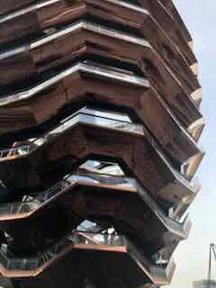
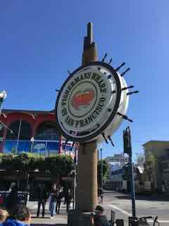
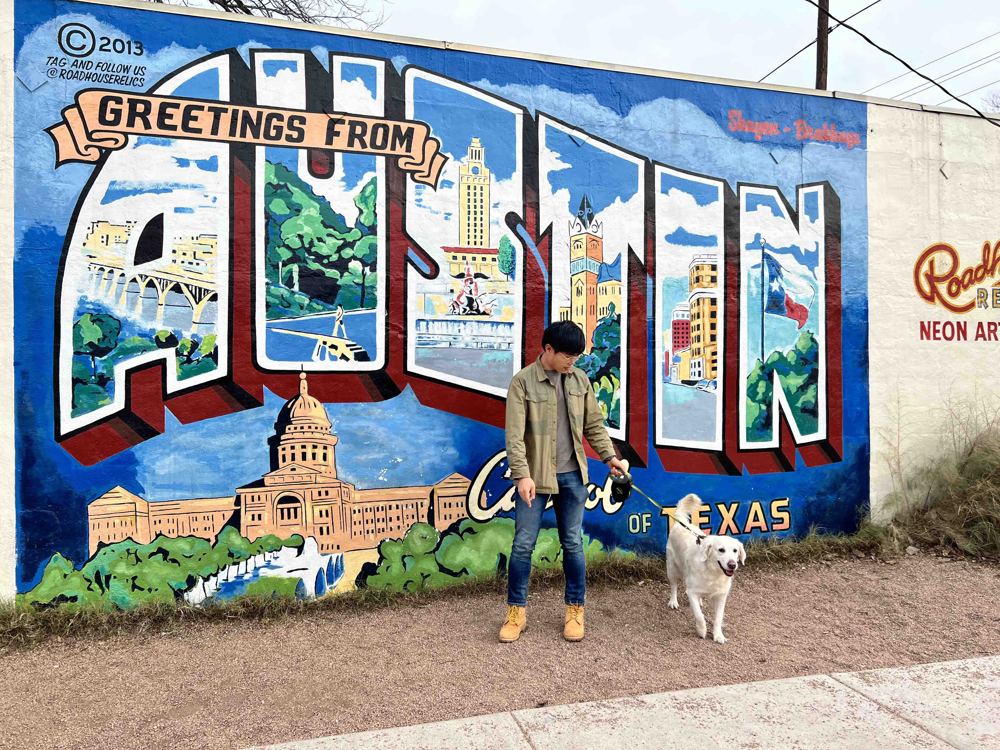

<head>
   <title>Places Traveled</title>
   <link rel = "stylesheet" href = "/assets/css/leaflet.css"/>
   
   
   <link rel="stylesheet" href="./assets/css/style.css">

</head>

<body>

   <!-- Title -->
   

         

            <h1>Places traveled in North America 
            and the journey continues...</h1>
         

   

   <!-- Map -->
   

   
</body>
